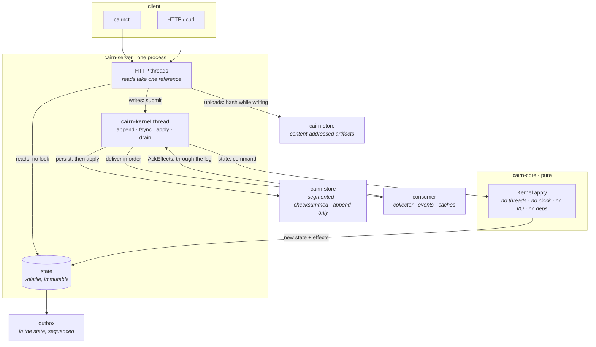

<h1 align="center">cairn</h1>

<p align="center">
  A deterministic model registry for Java.<br>
  Immutable versions, content-addressed artifacts, exactly-once side effects,<br>
  and a seeded simulator that checks twelve invariants after every step.
</p>

<p align="center">
  <a href="https://github.com/jason-te-sde/cairn/actions/workflows/ci.yml">
    
  </a>
  
  
  
  
  
  <a href="LICENSE"></a>
</p>

---

Here is how a real Raft-backed AI model registry stored a model version:

```java
// on the way out
modelId + ":" + version + ":" + s3Bucket + ":" + s3Key + ":" + fileHash + ":" + fileSize
        + ":" + description + ":" + createdAt

// on the way back in
String[] parts = data.split(":", 7);
```

Eight fields joined, seven split. Every record came back with the timestamp glued onto the
description, silently, forever. And because `s3Key` is field four and object keys contain colons —
`models/fraud/2.1.0:final/model.pt` is an ordinary key — one colon there shifted every field after
it, `Long.parseLong` was handed a hex string, and the exception was caught by this:

```java
} catch (Exception e) {
    LOG.error("Failed to apply model metadata", e);   // inside the state machine's apply method
}
```

So the command was dropped on that replica and applied on every other one, and all of them reported
healthy. In the same class, a few lines up, a Kafka publish sat inside the apply path — so every
restart republished the entire history — and the `fileHash` that was supposed to guarantee what you
were downloading came from the client and was never checked against the bytes.

cairn is that registry done properly. Five of the eight defects its test suite can reintroduce on
purpose are the ones above, and each has a named check that has to catch it.

Three things make it worth a read:

- **The rules are one pure function.** No threads, no clock, no I/O, no randomness, no dependencies.
  A whole registry — several replicas, their disks, a downstream consumer that crashes and comes
  back — is a function of one integer seed, so a bug found at seed 8123 is still there at seed 8123
  tomorrow.
- **The suite is proven to notice.** Eight known defects are put back on purpose and the check that
  catches each is asserted rather than documented. Two of them turned out to be caught somewhere
  more interesting than expected, and the tests say so instead of picking a check that worked.
- **It found real bugs in itself, and says which.** Six, listed below with what caught each one —
  including one that only exists because an effect in flight turned out to be part of the state.

## Try it

```bash
docker compose up -d --wait
docker compose run --rm cairnctl status
```

Without containers:

```bash
mvn package -DskipTests
./scripts/demo.sh          # this transcript, reproduced
```

Every line below is copied from a run of that script, not written by hand:

```console
$ cairnctl put embeddings.bin
sha256:59315d59c38e4ec253e5d2810b6fff7dcd532165d7a0ebae7fe669c9f4f2f081

$ cairnctl publish fraud@1.0.0 $V1 --parent=embeddings@1.0.0 --label=auc=0.9131
fraud@1.0.0
  artifact    sha256:cbe5a9d9c626a5cc7789c0e6e60ec4727037ce10970034cd2502d95c8d9816fc
  stage       staging                      # publishing never puts a version into production
  published   terigong at 1789120581022
  parents     embeddings@1.0.0
  auc         0.9131
  owner       risk

$ cairnctl stage fraud@2.0.0 production     # the incumbent is archived in the same command
fraud@2.0.0
  stage       production

$ cairnctl ls fraud
VERSION          STAGE        ARTIFACT         LABELS
1.0.0            archived     sha256:cbe5a9d9c626 {auc=0.9131, owner=risk}
2.0.0            production   sha256:c985a2f040e9 {auc=0.9402}

$ cairnctl lineage fraud@2.0.0
fraud@2.0.0
  ├─ embeddings@1.0.0  sha256:59315d59c38e  staging
  └─ fraud@1.0.0       sha256:cbe5a9d9c626  archived

$ cairnctl publish fraud@2.0.0 $V1          # same version, different bytes
cairnctl: immutable_version: fraud@2.0.0 already exists with artifact c985a2f040e9;
          a published version cannot be changed
exit 1

$ cairnctl rm fraud@2.0.0                   # it is in production
cairnctl: production_version: fraud@2.0.0 is in production; archive or deprecate it first
exit 1

$ cairnctl rm embeddings@1.0.0              # two live versions descend from it
cairnctl: has_descendants: embeddings@1.0.0 is declared as a parent by fraud@1.0.0;
          deleting it would leave that lineage dangling
exit 1

$ cairnctl verify
ok  served index 16 digest 030d4e28d7a4
    re-derived from the log: index 16 digest 030d4e28d7a4

$ kill -9 <the server>; start it again

$ cairnctl verify
ok  served index 16 digest 030d4e28d7a4
    re-derived from the log: index 16 digest 030d4e28d7a4
```

That last pair is the point of the whole design. `verify` re-derives the entire registry from the
log and compares it to what is being served, by canonical digest — and after a `kill -9`, with no
clean shutdown, it is the same twelve hex characters.

Run the script yourself and you will get a *different* digest, because a publish records the wall
clock it was given and that is part of the state. What reproduces is not the number: it is that the
two numbers are equal, before and after the crash.

```console
$ cairnctl state --at=6                     # the registry as it was six commands ago
at log index 6, state e8c70bdb4aec
  embeddings               1 live, production -
  fraud                    1 live, production -

$ tail -3 effects.jsonl
{"sequence":6,"type":"stage_changed","ref":"fraud@1.0.0","from":"production","to":"archived",...}
{"sequence":7,"type":"stage_changed","ref":"fraud@2.0.0","from":"staging","to":"production",...}
{"sequence":8,"type":"production_changed","model":"fraud","production":"2.0.0"}
```

The demotion arrives **before** the promotion. That ordering is guaranteed rather than incidental,
which is why a serving tier replaying this stream never holds two production versions — not even for
one message.

Requires JDK 21+ and Maven 3.9+, or just Docker.

**Before putting it anywhere real:** a node refuses to bind a non-loopback address without a token,
unless `--insecure` is passed. [`docs/operations.md`](docs/operations.md) covers the flags, what to
alert on, disk sizing, backup and restore, upgrades, and a symptom-to-cause table.

## Use it as a library

The kernel has no I/O, no threads and **no dependencies at all**, so it can be driven by something
other than this server — a Raft group, for instance. That is the module most people would want.

```xml
<dependency>
  <groupId>io.github.jason-te-sde</groupId>
  <artifactId>cairn-core</artifactId>
  <version>0.1.0</version>
</dependency>
```

| Module | What it is for | Dependencies |
| --- | --- | :---: |
| `cairn-core` | the rules, as one pure function | **none** |
| `cairn-codec` | canonical encoding; one state, one byte string | **none** |
| `cairn-store` | crash-recoverable log, snapshots, content-addressed blobs | SLF4J |
| `cairn-effects` | at-least-once delivery, at-most-once application | SLF4J |
| `cairn-testkit` | the simulator, the invariants, a second implementation, the flaws | SLF4J |
| `cairn-server` | the whole registry as one process, and `cairnctl` | SLF4J |

**Not on Maven Central yet.** The build signs and uploads from CI, but the account and signing key
behind it cannot live in the repository; [`SETUP-PUBLISHING.md`](SETUP-PUBLISHING.md) is what a
maintainer follows to supply them and [`RELEASING.md`](RELEASING.md) is the release sequence itself.
Until then, `mvn install` puts the modules in your local repository.

API documentation: **[jason-te-sde.github.io/cairn](https://jason-te-sde.github.io/cairn/)**,
published from `main` by CI. It is built with doclint on, so a broken reference fails the build
rather than becoming a 404 on the site.

## Architecture



The load-bearing rule is one sentence: **one thread owns the kernel, and reads never touch it.**
Each command publishes a new immutable state through one `volatile` field, so a reader holds a whole
consistent registry with no lock — and cannot see a half-applied command, because no such value
exists.

<details>
<summary><b>Why the dispatcher runs on that same thread</b></summary>

Not performance. Re-entrancy. The dispatcher has to propose `AckEffects` to move the delivery
watermark, and a proposal made from inside a queued task would deadlock on itself. Keeping the
dispatcher on the owning thread makes the acknowledgement just another append.

The consequence is a nice one: by the time a `DELETE` returns, the collection order it produced has
already been delivered and the artifact's bytes are gone. That is asserted in `ApiTest`.
</details>

<details>
<summary><b>Why side effects are values</b></summary>

The registry this replaces published to Kafka from inside its apply method. A replica replaying its
log therefore republished everything it had ever published — and replay is the normal path, not an
edge case — while a publish that failed was lost even though the state change that caused it was
durable. Either way the log and the world disagreed, with no metric, check or query that revealed
it.

Here the apply path produces a value and stops. Exactly-once is then two halves that each need
nothing from the other:

- **At least once**, from the dispatcher: it reads the outbox in order, delivers, and moves the
  watermark by proposing a command *through the log*. Every crash in that sequence redelivers rather
  than loses.
- **At most once**, from the consumer: `IdempotentSink` discards an offer at or below a durable
  watermark, and advances it only *after* the delivery returns. Because delivery is ordered, one
  integer is complete state for the whole stream.

No distributed transaction, and nothing required of the consumer but one durable number.
[`docs/design/0003-effects-are-values.md`](docs/design/0003-effects-are-values.md) has the crash
table.
</details>

<details>
<summary><b>Why an effect in flight is part of the state</b></summary>

This one came out of the simulator rather than out of a design session. An `ArtifactCollected`
sitting in the outbox is an instruction to delete bytes that has not been carried out, so this was
legal:

1. delete the last version referencing an artifact — a collection order is produced
2. re-ingest the same bytes — accepted, the artifact is present again
3. publish a new version against them — accepted
4. the collector finally runs and deletes the artifact the new version points at

So a `Blob` now records the sequence number of the order against it, and cannot come back until the
watermark has passed it (`COLLECTION_PENDING`, which the API returns as 503 because retrying later
will work). An artifact that is `present` therefore always has `collectSeq == 0` — enforced by the
record's constructor, so the bad state is not representable.
</details>

## What it does

| | Notes |
| --- | --- |
| **Immutable versions** | the artifact, parents and labels never change. A republish with identical content is an accepted *retry*; anything different is refused |
| **Content-addressed artifacts** | the digest is computed from the bytes while writing, never taken from the caller |
| **Reference counting** | an artifact is stored once however many versions point at it, and collected when the last live reference goes |
| **Lineage** | every declared ancestor must exist and be live; a version with live descendants cannot be deleted, so provenance never dangles |
| **Stages** | `STAGING → PRODUCTION → ARCHIVED / DEPRECATED`, as a relation rather than conditionals. Promotion demotes the incumbent in the **same** transition |
| **Exactly-once effects** | ordered outbox, retrying dispatcher, deduplicating consumer |
| **Idempotence in the log index** | applying an entry twice is a no-op, so no driver has to be careful |
| **Crash-recoverable log** | checksummed, append-only, torn tails survivable, prefix released after a snapshot |
| **Snapshots** | written atomically; a damaged one is skipped in favour of an older one rather than refusing to start |
| **Time travel** | `state --at=N` reconstructs any point in history, through the same code path recovery uses |
| **Integrity audit** | `verify` re-derives everything from the log and compares by canonical digest |

And the parts that are about being run rather than about correctness:

| | Notes |
| --- | --- |
| Bearer tokens | with a **separate** admin token, because ejecting what is in production is not the same privilege as publishing something nobody uses yet |
| Secure by default | a non-loopback bind without a token is refused unless `--insecure` |
| Prometheus metrics | including `cairn_outbox_depth`, the number that reveals a registry drifting away from the world while every other metric looks fine |
| `/healthz` and `/readyz` | which answer different questions |
| A container image | built by CI, then driven through a real publish, a promote, a read-back, a refused republish, and a `SIGKILL` restart that has to come back with the same state digest |
| An effect log | delivered effects as JSON lines with their sequence numbers — a queue any consumer can tail and deduplicate against |
| `fsck` | reports orphaned artifacts and **deletes nothing**, because a sweep that deleted whatever it could not find a reference for would race every upload in flight |

Not implemented, on purpose: **consensus** (this is the state machine, not the protocol — it is
designed to sit behind one), a persistent sorted map, outbox backpressure, semantic version
ordering, multi-tenancy, TLS, rate limiting, encryption at rest.
[`docs/design/0005-scope.md`](docs/design/0005-scope.md) gives the reasoning for each, and names
what was deliberately **not** taken from the system this project is derived from.

## Numbers

Measured on an Apple M-series laptop, APFS, JDK 25. Every figure has the command that produced it.

| | |
| --- | --- |
| Tests | **537** (529 on every build; 8 benchmarks off by default) |
| Line / branch coverage | **86.8% / 80.0%** |
| Hand-written Java | 11,186 lines main, 6,651 lines test, 112 files |
| Runtime dependencies | **SLF4J.** `cairn-core` and `cairn-codec` have none at all |
| Kernel throughput | **2,400,678 commands/s** |
| Simulation | 14,402 steps/s, **113,685 invariant checks/s** |
| Soak | 1,000 seeds, **3,166,609 invariant checks**, 12,034 crashes, 2,495 crashes between a delivery and its acknowledgement, **12.7s**, zero violations |
| Log append, fsync per command | **364 entries/s** |
| Log append, fsync per batch | 279,863 entries/s (15.1 MiB/s) |
| Log append, no fsync | 507,438 entries/s (27.3 MiB/s) |
| Recovery | 210,464 records/s |
| Snapshot | 9,466 round-trips/s; 4,851 bytes for 4 models, 24 versions, 7 artifacts |

```bash
mvn verify -Dcoverage                                         # tests and coverage

mvn install -DskipTests && mvn test -pl cairn-testkit -am \
    -Dtest=SoakTest -Dcairn.sim.seeds=1000 \
    -Dsurefire.failIfNoSpecifiedTests=false                   # soak

mvn test -Dcairn.bench=true \
    -Dtest='LogThroughputTest,ThroughputTest,KernelScalingTest' \
    -Dsurefire.failIfNoSpecifiedTests=false                   # every other number
```

Two of those rows are worth more than the rest.

**A durable write costs about 2.7 ms here**, so `SYNC_EACH` is bounded by the disk and everything
else is bounded by the CPU — a factor of about 770. A registry sees a handful of publishes a day, so
the right setting is the slow one, and the other two exist for bulk imports and for benchmarks
measuring something else.

**The kernel has a measured scaling limit, and it is not in the log.** Every publish copies the
version map of the model it touches, so publishing *N* versions into **one** model is O(N²):

| Versions in one model | Publishes/s | | Spread over 200 models |
| --- | --- | --- | --- |
| 100 | 234,949 | | |
| 1,000 | 65,074 | | |
| 5,000 | 17,266 | | |
| 10,000 | **9,169** | | **43,040** |

This was found by a benchmark, not by reasoning: a recovery measurement came back at three thousand
records a second, the log turned out to be fine, and the cost was here. The fix is a persistent
sorted map with structural sharing; it is not implemented, and
[`docs/design/0005-scope.md`](docs/design/0005-scope.md) says why. A measured limit with a named fix
is worth more than a hidden one.

## How it is tested

Six layers, each covering what the cheaper one below it cannot.

| Layer | Covers |
| --- | --- |
| **Unit** | one method, one transition, one rejection |
| **Rejection corpus** | what a decoder and a JSON parser must *refuse* |
| **Differential** | two implementations of one contract, required to agree after every command |
| **Simulation** | a whole registry from one seed, twelve invariants after every step |
| **Integration** | real sockets, real files, real `kill -9` |
| **Concurrency** | request threads on every read path while the owning thread writes |

The twelve invariants cover convergence, version immutability, reference integrity, collection
safety, stage exclusivity, effect-log integrity, exactly-once delivery, monotonicity, lineage
integrity, rejection purity, artifact integrity, and downstream agreement.
[`docs/testing.md`](docs/testing.md) has the table and what each one means.

Ten of them are checked from a read-only view, so they work against **any** implementation of the
rules. That is what makes the next part possible.

### The suite is proven to go red

`FlawTest` reintroduces eight specific defects and asserts that the check named in
`Flaw.caughtBy()` is the one that fails — the mapping is an assertion, not a comment, so a check that
stops working fails at the flaw it was supposed to catch.

| Flaw | From the original | Caught by |
| --- | :---: | --- |
| A colon-delimited record format | ✓ | `ColonCodecTest`, directly |
| Effects published from inside apply | ✓ | I7, after a replay |
| An apply failure swallowed and logged | ✓ | I1, as replica divergence |
| A restore that aliases live state to its snapshot | ✓ | `Recovery` refusing to start |
| A client-supplied digest stored unverified | ✓ | I11 |
| A republish that overwrites | | I2 |
| An artifact collected without counting references | | `Blob`'s constructor |
| A consumer watermark advanced before delivery | | I7 |

Two of those are more interesting than intended, and the tests say so rather than quietly picking a
check that worked:

- **The snapshot-aliasing defect is survivable on its own.** A snapshot that under-reports its index
  costs a longer replay and nothing else, because the log still holds the records. It becomes data
  loss only once the log is compacted on the strength of that snapshot — and then recovery refuses
  to start, which is a better outcome than an invariant firing later. The first version of the test
  asserted monotonicity and never fired.
- **Collecting without counting is caught by a record's constructor**, not by a test. `Blob` refuses
  to represent an absent artifact that live versions still reference, so the bug fails at the line
  that caused it. A bug caught by making the bad state unrepresentable beats one caught by a test.

The checker is itself checked. Half of `InvariantsTest` builds impossible states and requires the
right property to fail; the other half requires it **not** to fire on things that look wrong and are
legal — a replica replaying its log, an artifact legitimately re-ingested, a tombstone with a deleted
ancestor, delivery running ahead of the watermark. A checker that fired on those would be useless
under exactly the conditions it exists for.

### Bugs the tests found

<table>
<tr><th>Bug</th><th>What caught it</th></tr>
<tr>
<td><b>An <code>ArtifactCollected</code> effect still in the outbox could delete bytes that had
legitimately been re-ingested.</b> Delete the last version referencing an artifact, re-ingest the
same bytes, publish a new version against them, and then the collector finally runs — leaving a live
version pointing at nothing. Nothing in the state accounted for a decision that had been committed
and not yet carried out.</td>
<td>Working through what the simulator's downstream world would actually do, before the fault was
written. The fix added a field to <code>Blob</code>, a rejection code, and an invariant.</td>
</tr>
<tr>
<td><b><code>AckEffects</code> is a privileged command.</b> An acknowledgement from something that
has not delivered anything moves the delivery watermark past effects nobody sent, discarding them —
and the kernel cannot tell it from a real one. Exactly-once therefore holds only if the dispatcher is
the only thing that can propose one.</td>
<td>A simulation failing invariant I7: <code>effect #25 is acknowledged through 26 but was never
applied downstream</code>. The generator had been proposing them like any other command. Now a stated
property of the deployment, with no HTTP route that reaches it.</td>
</tr>
<tr>
<td><b><code>svarint</code> overflowed into the sign bit.</b> Zigzagging a value of large magnitude
sets the top bit, and the unsigned writer — correctly refusing a negative length — then refused a
correct encoding. Every timestamp beyond 2<sup>62</sup> ms was unwritable.</td>
<td>A boundary sweep over every byte-length transition, before the codec had ever been used for
anything.</td>
</tr>
<tr>
<td><b>A defensive copy was not defensive about ordering.</b>
<code>new TreeMap&lt;&gt;(sortedMap)</code> inherits the <i>source</i> map's comparator, so a caller
holding a reverse-ordered <code>SortedMap</code> — legal Java — would have got a reverse-ordered
registry back. Every canonical encoding here assumes ascending keys, so the digest that identifies a
replica would have depended on which map implementation built it.</td>
<td>A codec test that passed a reversed map in on purpose to check the encoder refused it, and
discovered the encoder never saw one.</td>
</tr>
<tr>
<td><b>A port's contract promised more than an implementation could deliver.</b>
<code>discardThrough</code> said it discarded "every record at or below" an index. The in-memory log
honoured that exactly; a segmented log can only free whole files. The two disagreed about
<code>firstIndex()</code> on the first seed that discarded anything.</td>
<td>A differential test between the two log implementations. <b>The contract was wrong</b>, not
either implementation — an append-only log cannot free records at an arbitrary boundary without
rewriting a file.</td>
</tr>
<tr>
<td><b>Segment reads issued two syscalls per record</b>, so replaying a log in batches was quadratic
in the number of records.</td>
<td>A benchmark — which then showed the <i>remaining</i> cost was not in the log at all, but in the
kernel's per-model map copy. That is now measured as a curve and documented as a limit rather than
being quietly absorbed into a recovery number.</td>
</tr>
<tr>
<td><b>Two read endpoints raced the thread that owns the log.</b> <code>GET /metrics</code> asked
the log for its size and threw <code>ClosedChannelException</code> when a checkpoint closed a
segment underneath it; <code>GET /v1/state</code> ran the entire replay path off-thread and threw
<code>ConcurrentModificationException</code> when the segment list was rebuilt. The log's javadoc
had said "a single thread owns the append path" since the first commit.</td>
<td>A concurrency test written to look for exactly this, after noticing <code>Engine.stats()</code>
was reachable from request threads. Saying a class is single-threaded turned out to be worth
nothing, so <code>FileCommandLog</code> now claims ownership on first use and refuses other threads
by name — which immediately caught a third instance, the engine recovering on one thread and
appending on another.</td>
</tr>
<tr>
<td><b>The jar dispatched <code>cairnctl --url=... status</code> to the server.</b> One jar is two
programs, and the rule for which was "is the FIRST argument a bare word". The client's own help
documents <code>--url=&lt;base&gt;</code> as a flag, so the natural invocation went to the server,
which refused <code>--url</code> as an unknown flag. The rule is now "is there a bare word
anywhere", which is unambiguous because no server flag is one.</td>
<td>The first CI run after the repository was pushed — two jobs independently, <code>clean
clone</code> and <code>container works</code>, because they were the only things that ran the client
with a leading flag. Nothing had tested the dispatch at all; it has fifteen cases now.</td>
</tr>
<tr>
<td><b>A documented command did not work.</b> <code>mvn test -pl cairn-testkit -Dtest=SoakTest</code>
leaves the parent POM out of the reactor, and the enforcer's <code>reactorModuleConvergence</code>
rule then refuses to run at all. It was in the README, the testing guide, two CI workflows, the
preflight script and four javadocs.</td>
<td>Running every command in the documentation instead of assuming it worked.</td>
</tr>
</table>

[`docs/testing.md`](docs/testing.md) also lists what the suite does **not** cover — no consensus
(there is none to test), no torn-sector injection, crash injection lands between steps rather than
between instructions, no concurrent writers of one digest, no load testing of the HTTP layer —
because a testing document that only lists strengths is marketing.

## Deploying it

```bash
cairnd --data-dir=/var/lib/cairn --address=0.0.0.0 --port=9080 \
       --token="$CAIRN_TOKEN" --admin-token="$CAIRN_ADMIN_TOKEN"
```

A node **refuses to bind a non-loopback address** without a client token unless `--insecure` is
passed. That is deliberate: a model registry decides what your serving tier loads, so an
unauthenticated one is a remote code execution primitive with extra steps.

| | |
| --- | --- |
| Client authentication | `--token`, and `--admin-token` for stage changes and deletions |
| Metrics | `/metrics`, `/healthz`, `/readyz` — the first without needing the token that can publish |
| Config | a properties file, with flags overriding it |
| Durability | `--durability=SYNC_EACH` by default, because a registry that loses a release is worse than a slow one |

[`docs/operations.md`](docs/operations.md) covers what to alert on, disk sizing, hot backup and
restore, upgrades, integrating a real consumer, and a symptom-to-cause table.
[`SECURITY.md`](SECURITY.md) is explicit about what is not defended: no TLS, no encryption at rest,
no identity model, no rate limiting, and an `actor` field that is not authentication.

## Reading the code

Half an hour, in this order:

| File | Why |
| --- | --- |
| [`core/Kernel.java`](cairn-core/src/main/java/io/cairn/core/Kernel.java) | the one function; every rule is in it |
| [`core/Effect.java`](cairn-core/src/main/java/io/cairn/core/Effect.java) | why side effects are values rather than statements |
| [`core/Blob.java`](cairn-core/src/main/java/io/cairn/core/Blob.java) | reference counting, and the field a simulation forced into existence |
| [`codec/Codec.java`](cairn-codec/src/main/java/io/cairn/codec/Codec.java) | why one state has exactly one byte string |
| [`effects/IdempotentSink.java`](cairn-effects/src/main/java/io/cairn/effects/IdempotentSink.java) | half of exactly-once, in four lines |
| [`store/Recovery.java`](cairn-store/src/main/java/io/cairn/store/Recovery.java) | startup, and the ordering that makes a checkpoint safe |
| [`server/Engine.java`](cairn-server/src/main/java/io/cairn/server/Engine.java) | one thread, and why the dispatcher runs on it |
| [`testkit/Invariants.java`](cairn-testkit/src/main/java/io/cairn/testkit/Invariants.java) | the twelve properties, as executable checks |
| [`testkit/ColonCodec.java`](cairn-testkit/src/main/java/io/cairn/testkit/ColonCodec.java) | the format this project replaces, runnable |

| Document | |
| --- | --- |
| [`docs/architecture.md`](docs/architecture.md) | layering, the owning thread, the durability boundary |
| [`docs/testing.md`](docs/testing.md) | what each layer proves, and the known gaps |
| [`docs/operations.md`](docs/operations.md) | running it: alerts, sizing, backup, upgrades, symptoms |
| [`docs/design/`](docs/design/) | one note per decision, each with its costs and rejected alternatives |

## Layout

```
cairn-core      the rules, as one pure function · no dependencies
cairn-codec     canonical encoding · one state, one byte string · no dependencies
cairn-store     crash-recoverable log, snapshots, content-addressed artifacts
cairn-effects   at-least-once delivery, at-most-once application
cairn-testkit   simulator, twelve invariants, a second implementation, the known flaws
cairn-server    HTTP, metrics, cairnctl · one thread owns the kernel
```

## License

MIT
